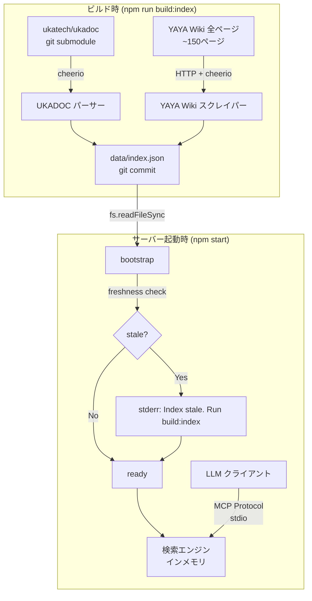

# 伺か技術ドキュメント検索 MCPサーバー

## 概要

伺か（Ukagaka）の開発に必要な技術仕様ドキュメントを、MCP（Model Context Protocol）サーバー経由で検索・参照できるようにする。

---

## 参照先の分析

### ソース①: UKADOC Project（ローカル / git submodule）

**リポジトリ**: [ukatech/ukadoc](https://github.com/ukatech/ukadoc) (GitHub)
**公開URL**: https://ssp.shillest.net/ukadoc/
**取得方式**: git submodule → ローカルHTMLパース
**形式**: HTML

> [!IMPORTANT]
> UKADOCはSSPの公式仕様書。HTMLファイルとしてGitHubで管理されているため、submoduleとして取り込み→ビルド時にパースしてインデックス化する。

#### `manual/` ディレクトリ — 開発者向け仕様書（**メインターゲット**）

| ファイル名 | カテゴリ | 内容 |
|---|---|---|
| `list_sakura_script.html` | さくらスクリプト | さくらスクリプト命令一覧（表示・動作制御の全コマンド） |
| `list_shiori_event.html` | SHIORIイベント | SHIORIに通知されるイベントID一覧と各Reference |
| `list_shiori_event_ex.html` | SHIORIイベント（拡張） | 追加・拡張イベント一覧 |
| `list_shiori_resource.html` | SHIORIリソース | SHIORIリソース通知一覧 |
| `list_plugin_event.html` | プラグインイベント | プラグインに通知されるイベント一覧 |
| `list_propertysystem.html` | プロパティシステム | プロパティシステムの仕様 |
| `descript_ghost.html` | 設定ファイル | ゴースト用 descript.txt の記述仕様 |
| `descript_shell.html` | 設定ファイル | シェル用 descript.txt の記述仕様 |
| `descript_shell_surfaces.html` | 設定ファイル | surfaces.txt の記述仕様（サーフェス定義） |
| `descript_shell_surfacetable.html` | 設定ファイル | surfacetable.txt の記述仕様 |
| `descript_balloon.html` | 設定ファイル | バルーン用 descript.txt の記述仕様 |
| `descript_install.html` | 設定ファイル | install.txt の記述仕様 |
| `descript_headline.html` | 設定ファイル | ヘッドライン用 descript.txt の記述仕様 |
| `descript_plugin.html` | 設定ファイル | プラグイン用 descript.txt の記述仕様 |
| `spec_shiori3.html` | プロトコル規格 | SHIORI/3.0 プロトコル仕様 |
| `spec_sstp.html` | プロトコル規格 | SSTP (Sakura Script Transfer Protocol) 仕様 |
| `spec_dll.html` | プロトコル規格 | DLLインターフェース仕様（SHIORI/SAORI等） |
| `spec_plugin.html` | プロトコル規格 | プラグインインターフェース仕様 |
| `spec_fmo_mutex.html` | プロトコル規格 | FMO/Mutex仕様（プロセス間通信） |
| `spec_headline.html` | プロトコル規格 | ヘッドライン仕様 |
| `spec_update_file.html` | プロトコル規格 | ネットワーク更新ファイル仕様 |
| `spec_web.html` | プロトコル規格 | Web関連仕様 |
| `manual_directory.html` | ファイル構成 | ディレクトリ構造の全体説明 |
| `manual_ghost.html` | ファイル構成 | ゴーストのファイル構成 |
| `manual_shell.html` | ファイル構成 | シェルのファイル構成 |
| `manual_balloon.html` | ファイル構成 | バルーンのファイル構成 |
| `manual_install.html` | ファイル構成 | インストール関連 |
| `manual_update.html` | ファイル構成 | ネットワーク更新のファイル構成 |
| `manual_translator.html` | ファイル構成 | MAKOTO(トランスレータ)の説明 |
| `manual_owner_draw_menu.html` | ファイル構成 | オーナードローメニュー |
| `dev_bind.html` | 開発ガイド | 着せ替え(BIND)の作り方 |
| `dev_nar.html` | 開発ガイド | NARアーカイブの作り方 |
| `dev_ownerdraw.html` | 開発ガイド | オーナードロー開発 |
| `dev_shell.html` | 開発ガイド | シェルの作り方 |
| `dev_shell_error.html` | 開発ガイド | シェルエラーの説明 |
| `dev_update.html` | 開発ガイド | ネットワーク更新のセットアップ |
| `memo.html` | 補足 | SSP仕様メモ |
| `memo_shiorievent.html` | 補足 | SHIORIイベント補足メモ |

---

### ソース②: YAYA Wiki (AYAYA/03)（外部 / ビルド時スクレイプ）

**Wiki URL**: https://emily.shillest.net/ayaya/ (PukiWiki Plus!)
**ライセンス**: Unlicense（パブリックドメイン）
**取得方式**: ビルド時にHTTPスクレイプ → パース → JSONインデックス生成
**形式**: PukiWiki HTML → 変換

> [!WARNING]
> YAYA WikiはPukiWiki Plus!ベースの外部サイト。GitHubの `YAYA-shiori/yaya-docs` はWikiのMarkdown変換ミラーだが、メンテナンスが負担とのことで更新が遅れるリスクがある。**Wiki本体を正規ソースとして扱う。**

#### コンテンツ構造（~150ページの技術ドキュメント）

| カテゴリ | ページ数 | 内容 |
|---|---|---|
| マニュアル/文法 | ~12 | YAYA言語文法: 基礎設定、関数定義、変数、演算、配列、フロー制御、プリプロセッサ、予約語、DLL仕様、文字コード |
| マニュアル/基本 | ~6 | 基礎概念: 変数、関数、条件分岐、ループ、配列、演算子 |
| マニュアル/関数 | **100+** | 組み込み関数リファレンス: 各関数が個別ページ (FREAD, SPLIT, GETTIME 等) |
| マニュアル/エラー処理関数 | ~5 | エラーハンドラ: shiori.OnCallLimit, OnLoopLimit 等 |
| システム辞書 | ~3 | yaya_shiori3.dic, yaya_optional.dic の解説 |
| StartUp | ~4 | チュートリアル: ゴーストの作り方、AYA/里々からの移行 |
| Tips | **40+** | 実践Tips: さくらスクリプト、メニュー構築、日付計算、高速化 等 |
| YAYA as SAORI/MAKOTO/PLUGIN | 3 | SHIORI以外でのYAYA利用方法 |

---

### ソース③: 里々Wiki（外部 / ビルド時スクレイプ）

**Wiki URL**: https://soliton.sub.jp/satori/ (PukiWiki 1.5.4)
**取得方式**: ビルド時にHTTPスクレイプ → パース → JSONインデックス生成
**形式**: PukiWiki HTML → 変換

> [!NOTE]
> 里々（Satori）はYAYAと並ぶ主要SHIORI実装。多くのゴーストが里々を使用している。

#### コンテンツ構造

| カテゴリ | ページ | 内容 |
|---|---|---|
| 資料 | 特殊記号一覧, 演算子一覧, 変数, 情報取得変数, 特殊変数, 関数一覧, ファイル構成 | 里々言語リファレンス |
| 独自イベント | 独自イベント | 里々固有SHIORIイベント |
| TIPS | TIPS総合, ゴースト作りのTIPSまとめ, 困ったときの対処法 + 個別TIPSページ | 実践的な使い方 |
| 里々について | 里々の内部処理, 栞としての里々 | アーキテクチャ解説 |
| SAORI | SAORI, SAORI/里々 | SAORI連携 |

---

### セカンダリソース（将来的な拡張候補）

| ソース | URL | 内容 | 優先度 |
|---|---|---|---|
| yaya-docs (GitHub) | YAYA-shiori/yaya-docs | Wikiのバックアップ。フォールバック用 | 低（Wiki不通時） |
| 伺か公式仕様書 | usada.sakura.vg | MATERIA時代の元祖仕様書 | 低（歴史的参考） |

---

## 決定事項

- ✅ **データソース**: UKADOC (submodule) + YAYA Wiki + **里々Wiki** の3ソース
- ✅ **UKADOC取得**: git submodule → ビルド時にローカルHTMLパース
- ✅ **YAYA取得**: `npm run build:index` でフルスクレイプ → `data/index.json` をgitコミット
- ✅ **里々Wiki取得**: `npm run build:index` でフルスクレイプ（YAYA Wikiと同様）
- ✅ **UKADOCスコープ**: `manual/` のみ（開発者向け仕様書）
- ✅ **YAYAスコープ**: マニュアル, Tips, StartUp, システム辞書, SAORI/MAKOTO/PLUGIN
- ✅ **里々Wikiスコープ**: 資料, 独自イベント, TIPS, SAORI（FrontPage・ログイン・コメント等のメタページは除外）
- ✅ **ツール数**: 3ツール（`search_docs` + `get_doc` + `list_categories`）
- ✅ **トークン問題対策**: `search_docs` は要約(500文字)を返す。`get_doc` で全文取得
- ✅ **ランタイムアーキテクチャ**: 起動時にディスクからインデックス読み込み → freshness警告 → インメモリ検索。**ネットワーク通信ゼロ**
- ✅ **`data/index.json`**: gitにコミット（npm install 直後に動作）
- ✅ **RSS差分更新**: **廃止**（敵対的レビューv2で決定）

---

## アーキテクチャ

### 全体図



### 起動シーケンス

```
1. data/index.json を読み込み（ディスクI/Oのみ）
2. freshness判定: generatedAt が7日超 → stderrに警告
3. インメモリ検索エンジンにロード
4. stdioトランスポート接続 → 即座にready
```

> [!TIP]
> 起動時のネットワーク通信はゼロ。ディスク読み込みのみなので即時起動。インデックスの最新化は `npm run build:index` を手動実行して git commit する運用。

### 設計原則（敵対的レビューv1+v2反映済み）

| 原則 | 理由 |
|---|---|
| **起動時ネットワーク通信ゼロ** | jp-labor-evidence-mcp の bootstrap パターン。ディスクからロードするだけ |
| **TTLキャッシュ不使用** | ランタイムに外部通信なし |
| **ToolEnvelope不使用** | `retryable`, `degraded` 等のステータスが発生しない |
| **ディスク永続化はビルド成果物のみ** | `data/index.json` はgitコミット。ランタイムでの書き込みは不要 |
| **freshness判定** | jp-labor-evidence-mcp の `STALE_AFTER_MS` パターン。7日超で `stale` 警告 |
| **canonical_id** | jp-labor-evidence-mcp の `canonical_id` パターン。URLではなくページパスベース |
| **content truncation** | 1エントリ最大4000文字。LLMのコンテキスト消費を制限 |

### レスポンス型

```typescript
// search_docs は要約を返す（トークン爆発防止）
type SearchResult = {
  status: 'ok' | 'not_found' | 'error';
  data?: SearchEntry[];
  total?: number;
  message?: string;
};

type SearchEntry = {
  id: string;           // canonical_id (get_doc で全文取得に使用)
  title: string;
  source: Source;
  category: Category;
  summary: string;      // content 先頭500文字（検索結果表示用）
  url: string;
};

// get_doc は全文を返す
type DocEntry = SearchEntry & {
  content: string;      // 全文テキスト（truncation なし）
};

// インデックスファイルの型（内部保存用）
type IndexFile = {
  version: number;
  generatedAt: string;
  entries: DocEntry[];  // content は全文保存。search時にsummaryを生成
};

// ソース定義
type Source = 'ukadoc' | 'yaya_wiki' | 'satori_wiki';

// カテゴリ定義（単一ソース。パーサー・ツール共有）
const CATEGORIES = {
  // UKADOC
  sakurascript:    { source: 'ukadoc',      label: 'さくらスクリプト命令' },
  shiori_event:    { source: 'ukadoc',      label: 'SHIORIイベント一覧' },
  descript:        { source: 'ukadoc',      label: '設定ファイル仕様' },
  protocol:        { source: 'ukadoc',      label: 'プロトコル仕様' },
  file_structure:  { source: 'ukadoc',      label: 'ファイル構成' },
  dev_guide:       { source: 'ukadoc',      label: '開発ガイド' },
  // YAYA Wiki
  yaya_grammar:    { source: 'yaya_wiki',   label: 'YAYA文法' },
  yaya_basic:      { source: 'yaya_wiki',   label: 'YAYA基礎概念' },
  yaya_function:   { source: 'yaya_wiki',   label: 'YAYA組み込み関数' },
  yaya_system:     { source: 'yaya_wiki',   label: 'システム辞書' },
  yaya_tips:       { source: 'yaya_wiki',   label: '実践Tips (YAYA)' },
  yaya_startup:    { source: 'yaya_wiki',   label: 'チュートリアル (YAYA)' },
  // 里々Wiki
  satori_reference:{ source: 'satori_wiki', label: '里々リファレンス（記号・演算子・変数・関数）' },
  satori_event:    { source: 'satori_wiki', label: '里々独自イベント' },
  satori_tips:     { source: 'satori_wiki', label: '実践Tips (里々)' },
  satori_saori:    { source: 'satori_wiki', label: '里々 SAORI連携' },
} as const;
type Category = keyof typeof CATEGORIES;
```

---

## MCPツール設計

### ツール一覧（3ツール体制）

#### 1. `search_docs`

**説明**: 伺か・YAYA・里々の技術ドキュメントをキーワード検索する。**要約（500文字）を返す**。詳細は `get_doc` で取得。

| パラメータ | 型 | 必須 | 説明 |
|---|---|---|---|
| `query` | string | ✅ | 検索キーワード |
| `category` | string | ❌ | カテゴリで絞り込み（`list_categories` で取得可能な値） |
| `source` | string | ❌ | `ukadoc` / `yaya_wiki` / `satori_wiki` でソースを絞り込み |
| `limit` | number | ❌ | 返却件数の上限（デフォルト10、最大50） |

**検索仕様**:
- 大文字小文字無視
- 日本語・英語とも部分一致
- バックスラッシュ前処理: `\\s` → `\s` に正規化してからマッチ
- スコアリング: タイトル完全一致 > タイトル部分一致 > 本文部分一致
- 返却: `SearchEntry`（`summary` = content先頭500文字）

> [!TIP]
> 10件 × 500文字 = 5000文字 ≒ 1250トークン。コンテキスト消費を制御。

#### 2. `get_doc`

**説明**: `search_docs` で得た `id` を指定して、ドキュメントの全文を取得する。

| パラメータ | 型 | 必須 | 説明 |
|---|---|---|---|
| `id` | string | ✅ | canonical_id（例: `yaya:マニュアル/関数/REPLACE`, `satori:関数一覧`）|

**返却**: `DocEntry`（`content` = 全文、truncationなし）

#### 3. `list_categories`

**説明**: 検索に使えるカテゴリ一覧を返す。パラメータなし。`CATEGORIES` 定数から生成。

### Server Instructions

```
このサーバーは伺か（Ukagaka）の技術ドキュメントを検索します。

3つのソースからドキュメントを提供します:
- UKADOC: SSP公式仕様書（さくらスクリプト、SHIORIイベント、設定ファイル仕様、プロトコル規格）
- YAYA Wiki: YAYA SHIORIの文法、組み込み関数、実践Tips
- 里々Wiki: 里々SHIORIの構文、変数、関数、独自イベント、Tips

推奨ワークフロー:
1. `list_categories` でカテゴリ一覧を確認
2. `search_docs` でキーワード検索（要約を返す）
3. 詳細が必要なエントリは `get_doc(id)` で全文を取得

注意事項:
- ビルド時点のドキュメントスナップショットを検索します
- さくらスクリプトのタグ検索: \s0 のように入力（バックスラッシュはそのまま）
```

---

## 技術スタック

- **言語**: TypeScript (Node.js), ESM (`"type": "module"`)
- **MCP SDK**: `@modelcontextprotocol/sdk` ^1.26.0
- **バリデーション**: `zod`
- **HTMLパーサー**: `cheerio` (UKADOC + YAYA Wiki + 里々WikiのHTMLパース)
- **HTTPクライアント**: Node.js 標準 `fetch` (YAYA Wiki + 里々Wikiスクレイプ。ビルド時のみ使用)
- **検索**: カスタムインメモリ全文検索（キーワードマッチング + スコアリング + バックスラッシュ正規化）
- **テスト**: `vitest`
- **開発**: `tsx`

> [!NOTE]
> `jp-labor-evidence-mcp` から採用するパターン:
> - **bootstrap**: 起動時ディスクロード
> - **freshness判定**: `STALE_AFTER_MS` による警告
> - **canonical_id**: ページパスベースの正規化ID
> - **カテゴリ定数の単一ソース化**: パーサーとツールで共有
>
> 採用しないパターン: TTLキャッシュ、ToolEnvelope、staged→promote、sync-runner

---

## 実装フェーズ

### Phase 1: プロジェクト初期化
- `npm init` + TypeScript + ESM 設定
- `@modelcontextprotocol/sdk`, `zod`, `cheerio` インストール
- git submodule で `ukatech/ukadoc` を追加
- `src/constants.ts` で `CATEGORIES` 定数を定義
- 起動時のindex存在チェック（`data/index.json` 不在 → エラー終了）

### Phase 2: UKADOC パーサー
- **事前作業**: 代表HTMLの文字エンコーディング確認（`file` コマンド + `<meta charset>`）
- `cheerio` でHTML解析 → セクション単位の構造化テキスト抽出
- canonical_id 生成: `ukadoc:{filename}:{section_anchor}`
- content truncation: 4000文字上限
- 関数リファレンス・テーブル行はエントリ単位まで細分化

### Phase 3: YAYA Wiki スクレイパー
- ターゲットURL一覧の定義（マニュアル/*, Tips/*, StartUp/*, etc. — PukiWikiメタページは除外）
- HTTP取得 → `cheerio` でコンテンツ領域のみ抽出（ナビゲーション除去）
- canonical_id 生成: `yaya:{page_path}` (URLデコード済み日本語パス)
- YAYA関数ページ（マニュアル/関数/*）は **1ページ=1エントリ**（セクション分割しない）
- レート制限: 500ms/リクエスト

### Phase 4: 里々Wiki スクレイパー
- ターゲットURL一覧の定義（`?ページ名` 形式 — FrontPage・ログイン・差分等のメタページは除外）
- 主要ページ: 特殊記号一覧, 演算子一覧, 変数, 情報取得変数, 特殊変数, 関数一覧, 独自イベント, TIPS総合, ゴースト作りのTIPSまとめ, 困ったときの対処法, SAORI, SAORI/里々
- HTTP取得 → `cheerio` でコンテンツ抽出（PukiWikiナビゲーション除去）
- canonical_id 生成: `satori:{page_name}` (URLデコード済み)
- レート制限: 500ms/リクエスト

### Phase 5: インデックス統合 & 検索エンジン
- UKADOC + YAYA Wiki + 里々Wiki → `data/index.json` 統合
- ビルド後のサイズ計測（実測値をREADMEに記載）
- インメモリ検索エンジン: キーワードマッチング + スコアリング + カテゴリ/ソースフィルタ
- バックスラッシュ前処理（`\\s` → `\s`）をクエリとコンテンツ両方に適用
- `limit` パラメータ対応（デフォルト10、最大50）
- `search_docs` → `SearchEntry`（summary = content先頭500文字）を返す

### Phase 6: MCPサーバー
- bootstrap: `data/index.json` ロード + freshness判定
- `createServer()` + `instructions` 設定
- `search_docs` ツール実装（SearchEntry返却）
- `get_doc` ツール実装（id → DocEntry全文返却）
- `list_categories` ツール実装（`CATEGORIES` 定数から生成）
- stdioトランスポート接続

### Phase 7: テスト・検証
- パーサーのユニットテスト（UKADOC / YAYA / 里々 各サンプルHTMLから抽出結果検証）
- 検索のユニットテスト（スコアリング・フィルタリング・バックスラッシュ正規化）
- `get_doc` のユニットテスト（id正規化・存在しないidの処理）
- freshness判定のユニットテスト
- MCP接続テスト（Claude Desktop等から実際に接続）

---

## ファイル構造案

```
ukagaka-doc-mcp/
├── package.json
├── tsconfig.json
├── src/
│   ├── index.ts                # MCPサーバーエントリポイント
│   ├── server.ts               # createServer + instructions + ツール登録
│   ├── bootstrap.ts            # index.json ロード + freshness判定
│   ├── constants.ts            # CATEGORIES, Source, STALE_AFTER_MS等
│   ├── tools/                  # MCPツール定義
│   │   ├── search-docs.ts      # 統合検索ツール（summary返却）
│   │   ├── get-doc.ts          # 全文取得ツール（id → DocEntry）
│   │   └── list-categories.ts  # カテゴリ一覧
│   ├── parser/                 # ドキュメントパーサー
│   │   ├── ukadoc-parser.ts    # UKADOC HTMLパース
│   │   ├── yaya-scraper.ts     # YAYA Wiki スクレイプ + パース
│   │   └── satori-scraper.ts   # 里々Wiki スクレイプ + パース
│   ├── search/                 # 検索エンジン
│   │   └── engine.ts
│   ├── build-index.ts          # ビルドスクリプト (npm run build:index)
│   └── types.ts                # 共通型定義 (DocEntry, SearchEntry, IndexFile等)
├── data/                       # gitコミット対象
│   └── index.json              # 統合インデックス
├── docs/                       # git submodules
│   └── ukadoc/                 # ukatech/ukadoc
├── tests/
│   ├── fixtures/               # テスト用サンプルHTML
│   ├── parser/
│   │   ├── ukadoc-parser.test.ts
│   │   └── yaya-scraper.test.ts
│   └── search/
│       └── engine.test.ts
└── README.md
```

---

## User Review Required

> [!NOTE]
> 全項目確認済み。未決事項なし。

- ~~**レート制限値**~~: 500ms/リクエスト で仮置き確定

---

## Verification Plan

### Automated Tests
- UKADOC パーサー: サンプルHTMLの固定入力からの出力が期待値と一致するか (vitest)
- YAYA スクレイパー: テスト用のHTML固定ファイルからの出力が期待値と一致するか (vitest)
- 里々スクレイパー: テスト用のHTML固定ファイルからの出力が期待値と一致するか (vitest)
- 検索エンジン: スコアリング・フィルタリング・バックスラッシュ正規化の正確性 (vitest)
- `get_doc`: 正常取得・存在しないidのnot_found返却 (vitest)
- freshness判定: 7日超で `stale` が返るか (vitest)
- テストフィクスチャ: `tests/fixtures/` にサンプルHTMLを配置（モック入力）

### Manual Verification
- Claude Desktop から接続し、以下のクエリが正しく動作することを確認:
  - `search_docs({ query: "\\s" })` → さくらスクリプトのサーフェス切替が見つかる（summary返却）
  - `get_doc({ id: "ukadoc:list_sakura_script:..." })` → 全文が返る
  - `search_docs({ query: "OnBoot", category: "shiori_event" })` → OnBootイベントが見つかる
  - `search_docs({ query: "REPLACE", source: "yaya_wiki" })` → YAYA関数のREPLACE仕様が見つかる
  - `search_docs({ query: "特殊記号", source: "satori_wiki" })` → 里々の特殊記号一覧が見つかる
  - `list_categories()` → 全16カテゴリが返る
- freshness警告の確認:
  - 最新ビルドのインデックス → 警告なし
  - 8日前ビルドのインデックス → stderrに `"Index is stale (built 8 days ago). Run: npm run build:index"` が出る
